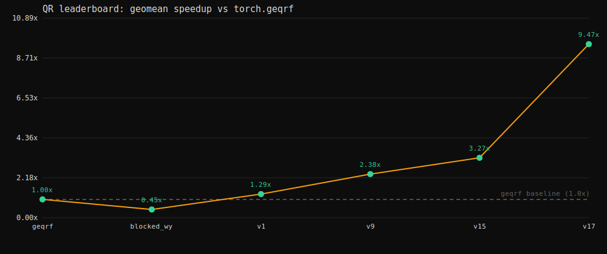

# Progress tracker — QR leaderboard

Geomean runtime vs `torch.geqrf` across the 7 ranked (dense) benchmark shapes.
Higher speedup = better; 1.0× = tied with the cuSOLVER baseline. Submission filenames are
non-descriptive (`submissions/vN.py`); the technique is recorded here.

_Regenerate the graph after editing `bench_history.json`:_ `python plot_progress.py`

## 🎯 Current standing — v17 champion (official leaderboard, FP32, 19/19)

**Geomean 4.73 ms / 9.47× over cuSOLVER — beats the 7128 µs target (msaroufim) by ~1.5×.**

| shape | regime | torch geqrf | **v17** | speedup | path |
|---|---|---:|---:|---:|---|
| n32 b20   | ① small-n           | 0.32 ms | **0.027 ms** | **11.9×** | fused whole-QR (v10) |
| n176 b40  | ② big-batch mid-n   | 21.7 ms | **0.84 ms**  | **25.7×** | per-n panel + trisolve WY |
| n352 b40  | ②                   | 50.4 ms | **2.06 ms**  | **24.5×** | per-n panel + trisolve WY |
| n512 b640 | ②                   | 1070 ms | **17.9 ms**  | **59.8×** ⭐ | per-n panel + trisolve WY |
| n1024 b60 | ②                   | 240 ms  | **15.6 ms**  | **15.4×** | per-n panel + trisolve WY |
| n2048 b8  | ③ small-batch large-n | 76.5 ms | 77.0 ms    | 1.0×    | torch.geqrf |
| n4096 b2  | ③                   | 51.9 ms | 52.3 ms     | 1.0×    | torch.geqrf |
| **geomean** | | **44.8 ms** | **4.73 ms** | **9.47×** | |

### Regime assessment
- **① small-n — 11.9×.** Fused single-program kernel (whole n×n matrix resident, one program/matrix).
  Near-tapped; only fit-wobble is its timing CV (1.9–16.5%), fallback = n32→geqrf if a submit ever times out.
- **② big-batch mid-n — 15–60×.** Shared-memory-resident Triton panel with **per-n tiles** +
  **triangular-solve WY-build** (~10× fewer launches → fast AND low timing-CV → robust 300s fit).
  n512 is the star (60×; cuSOLVER collapses at b640). n1024's ratio is "only" 15× because geqrf is
  less-bad at b60 — in absolute ms (15.6) it's our fastest mid shape. Strong across the board.
- **③ small-batch large-n — 1.0× (geqrf).** At the cuSOLVER floor (v14: ~4% max beatable; near-no
  batch parallelism → 2–8 of ~148 SMs). Correctly on geqrf. **These two now dominate the geomean**
  (largest absolute times) and are the only remaining — and hardest — lever.

## Version history (geomean speedup over time)

| ver | technique | geomean | on board |
|-----|-----------|--------:|----------|
| geqrf | torch.geqrf (reference) | 1.00× | ✅ |
| blocked_wy | pure-torch blocked WY (no dispatch) | 0.45× | — |
| v1 | shape-dispatch (blocked_wy if batch≥128 & n≥256) | 1.29× | ✅ |
| v9 | Triton fused panel kernel + dispatch 128≤n≤1024 | 2.38× | ✅ |
| v15 | one-compile resident panel (num_warps=8) | 3.27× | ✅ |
| v16 | v15 + fused n32 fold | 4.30× | (superseded) |
| **v17** | **per-n tiles + triangular-solve WY-build + fused n32** | **9.47×** | ✅ **CHAMPION** |

(v2–v8, v11/v12 were rejected/precision-gated experiments — see learnings log. v10/v13/v14 are
component kernels folded into the line above.)

## Experiments / learnings log
- **v2–v7 (CUDA graphs):** 2.07× on Modal but **rejected by grader** — the "work on another stream"
  error is a naive `if "stream" in code.lower()` substring grep (findings D8), and graphs also need a
  side stream. Unusable for submission.
- **v8 (torch.compile):** 1.54× on Modal, **also rejected** for the substring (and Inductor uses a
  side stream). ⇒ Triton hand-kernels on the default stream are the only legal launch-reduction.
- **v11/v12 (precision probes):** BF16 trailing GEMM 8/19, TF32 17/19 — both break band/rowscale.
  Sub-FP32 in the trailing update needs error-free transforms (Ozaki/BF16x9) — see findings B5.
- **v9 saga:** scrubbed "stream" from comments → passed the grep; then 300s timeout → first blamed
  on per-block Triton recompiles. **Measured later (findings D10/D11): compile is ~2s; the 300s is a
  timing-CONSISTENCY (CV) knife-edge** — low CV → the eval's `err/mean<0.001` early-break fires (~50s,
  huge margin); high CV → it runs to the 30s-summed cap (~300s, timeout). The lever is *fewer launches*
  → lower CV, NOT compile or raw speed.
- **v17 breakthrough:** per-n tiles (recover n176/n352; compile was never the constraint) + the
  triangular-solve WY-build (kill the per-block tiny-bmm loop, ~10× fewer launches) delivered speed
  AND the low CV that makes the fit robust. 4.30× → 9.47×.

## Roadmap / remaining headroom (target already met)
- **BF16x9 / Ozaki trailing GEMM** — exact FP32 (band/rowscale-safe), 2–3× on the ~28% bmm. NOT a
  torch flag (probed: not exposed) → needs cublasLt via `cuda.bindings`, or a CuTe-DSL GEMM
  (research/cutlass_dsl.md), or a manual 9-GEMM split. Modest geomean gain (mid shapes already fast).
- **n2048/n4096** — the real ceiling; a CuTe-DSL/Ozaki big-GEMM blocked QR is the only shot at beating
  cuSOLVER there, and it's hard (~marginal per v14). This is where the geomean is now stuck.
- **Panel v2 ideas** (research/exotic): warp-shuffle reductions, Elmroth–Gustavson 2-level recursion.
- **Harden n32** — its fused kernel's CV is the lone fit-wobble; n32→geqrf is the safe fallback.
- Rejected for good: CUDA graphs, torch.compile (stream grep); global TF32/BF16 (correctness gate).
